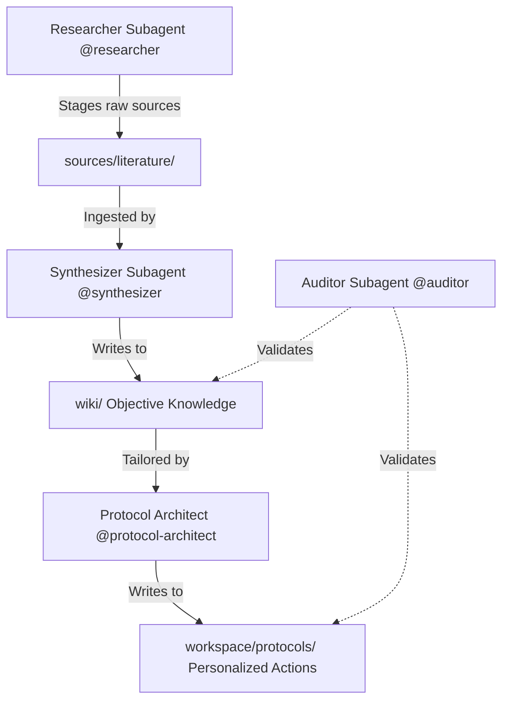

# 🦎 Podarcis — The Research and LLM Wiki Agent

| | |
| --- | --- |
| <br>⠀⠀⠀⠀⠀⠀⠀⠀⠠⣽⣆⡄⠀⠀⠀⠀⠀⠀⠀⠀⠀⠀⠀⠀⠀⠀<br>⠀⠀⠀⣤⣤⣤⣤⣄⡚⠻⣿⡀⠀⠀⠀⠀⠀⠀⠀⠀⠀⠀⠀⠀⠀⠀<br>⠀⠀⠀⣿⣿⣿⣿⣿⣿ ⣸⣿⠀⠀⠀⠀⠀⠀⠀⠀⠀⠀⠀⠀⠀⠀<br>⠀⢀⡀⠸⢿⣿⣿⣿⣿⣶⣿⠃⠀⠀⠀⠀⠀⠀⠀⠀⠀⠀⠀⠀⠀⠀<br>⠐⠲⣿⣼⠂ ⣿⣿⣿⣿⣿⣆⠀⢀⡀⠀⠀⠀⠀⠀⠀⠀⠀⠀⠀⠀<br> ⠈⠙⠻⣶⣼⣿⢿⣿⣿⣿⣿⡆⠙⢿⣦⣄⣀⠀⠀⠀⠀⠀⠀⠀⠀<br>⠀⠀⠀⠀⠀⠉⠁⢸⣿⣿⣿⣿⣿⠀⣀⣄⠉⠙⠛⠿⢷⣦⣀⠀⠀⠀<br>⠀⠀⠀⠀⢀⠰⣶⣶⣿⣿⣿⣿⣿⣿⣿⣿⡀⣠⠄⠀⠀⠈⠻⣿⡆⠀<br>⠀⠀⠠⠶⢮⣷⣿⡋⠋⠉⢹⣿⣿⠉⠀⠻⣷⣿⣿⡉⠓⠀⠀⢹⣿⠀<br>⠀⠀⠀⠋⠹⠉⠙⠁⠀⠀⠈⣿⣿⡇⠀⠀⠈⠉⠆⠁⠀⠀⠀⢸⣿⠇<br>⠀⠀⠀⠀⠀⠀⠀⠀⠀⠀⠀⠘⢿⣿⣄⠀⠀⠀⠀⠀⠀⠀⢀⣾⣿⠁<br>⠀⠀⠀⠀⠀⠀⠀⠀⠀⠀⠀⠀⠈⠻⣿⣦⣄⡀⡀⢀⣠⣴⣿⣿⠃⠀<br>⠀⠀⠀⠀⠀⠀⠀⠀⠀⠀⠀⠀⠀⠀⠈⠛⠿⠿⣿⣿⠿⠿⠋⠁⠀⠀<br> | **Podarcis**<br> *The Research and Wiki Builder Agent* <br><br>Installation:<br>```git clone https://github.com/XicuM/Podarcis.git```<br>```cd Podarcis```<br>```./podarcis install```<br> |

## 🚀 The Workflow Pipeline

Evidence progresses through a strict pipeline with a formal **Hierarchy of Evidence**:



1. **Research (`@researcher`)**: Discovers literature via `research-mcp` (Semantic Scholar), scrapes Google Drive, downloads PDFs, and extracts text with markitdown into `sources/literature/`.
2. **Synthesis (`@synthesizer`)**: Finds sources not yet cited anywhere in `wiki/` (status derived live from the citation graph — no manifest to go stale), ingests them, and compiles objective, anonymized knowledge into `wiki/`.
3. **Protocol Architect (`@protocol-architect`)**: Reads `workspace/profile.md`, adapts Wiki findings into step-by-step personalized protocols in `workspace/protocols/` (loading `menumaker` for nutritional protocols).
4. **Audit (`@auditor`)**: Runs continuous machine validation — link integrity (`podarcis lint`), OKF v0.2 frontmatter audits, citation verification, and fact-checking.

---

## 📁 Repository Structure

```text
├── .agents/                 # Core agent personas, MCP servers, and skills
│   ├── agents/              # Subagent personas (researcher, synthesizer, protocol-architect, auditor)
│   ├── mcp/                 # MCP servers (wiki, research, repo, menumaker, diagnostics)
│   └── skills/              # Domain knowledge (menumaker, self-improvement, python-skill)
├── .opencode/               # OpenCode adapter configuration
│   └── agents -> ../.agents/agents  # Relative symlink for OpenCode subagent integration
├── .podarcis/               # Podarcis runtime engine, TUI CLI, jobs runner, and web server
├── sources/                 # Decoupled Repository: Staging area for raw inputs & ingestion queue
├── wiki/                    # Decoupled Repository: Objective knowledge base (anonymized)
├── workspace/               # Decoupled Repository: Personal profile, feedback, protocols
├── tmp/                     # Temporary scratchpad workspace
├── pyproject.toml           # Python packaging and pytest configuration
└── AGENTS.md                # Agent architecture, conventions, and rules of engagement
```

---

## 🛠 Features & Capabilities

* **Subagent Architecture**: Four specialized subagents (`Researcher`, `Synthesizer`, `Protocol Architect`, `Auditor`) auto-invoked by the primary agent based on task context.
* **Model Context Protocol (MCP)**: Native servers (`wiki-mcp`, `research-mcp`, `diagnostics-mcp`, `market-mcp`) enable knowledge base queries, literature search, pain-point logging, and market data. The bound surface is exactly what a Bash-less agent job can reach; everything a human drives — repo syncing, menu optimization, resolving pain points — is a `podarcis` subcommand instead.
* **Modular Podarcis Engine**: The `.podarcis/` Python package provides interactive setup, CLI tools (`podarcis status`, `podarcis test`, `podarcis lint`), and background jobs engine.
* **Hermetic Repositories**: `wiki/`, `workspace/`, and `sources/` are decoupled git repositories ensuring clear separation between objective knowledge and user privacy.
* **Team Habitat & Multi-User Support**: Use [**PodarcisNest**](https://github.com/XicuM/PodarcisNest) for multi-user container orchestration, dynamic reverse proxying, shared OKF knowledge mounts, and Slack research bots.

---

## 🦎 Podarcis Ecosystem

* **[Podarcis](https://github.com/XicuM/Podarcis)** (This Repo): The core evidence-based research engine, FastMCP gateway (`podarcis-mcp`), CLI, and multi-agent personas (`researcher`, `synthesizer`, `protocol-architect`, `auditor`).
* **[PodarcisNest](https://github.com/XicuM/PodarcisNest)**: Multi-User LLM Wiki Server Infrastructure, Starlette reverse proxy, and Slack Socket Mode daemon for research teams.

---

## ⚙️ Quick Start & Setup

### 1. Clone the Repository
```bash
git clone https://github.com/XicuM/Podarcis.git
cd Podarcis
```

### 2. Run Automated Setup
```bash
./podarcis install
```
This automatically configures the virtual environment, installs dependencies, sets up credentials, links the `podarcis` CLI tool, and clones sub-repositories.

### 3. Optional External Engines

**qmd** — local-first hybrid retrieval (BM25 + vector + cross-encoder rerank + HyDE) backing `wiki_search`'s semantic modes and `wiki_reindex`. Without it, `wiki_search` degrades to keyword-only, which your agent harness already provides as `Grep` — so the semantic modes are the entire reason the tool exists. Enable with `engines: { qmd: true }` in `.podarcis/config.yaml`.

It is a Node package, `@tobilu/qmd`, not a Python dependency — `podarcis install` does not fetch it. Install it yourself:

```bash
# Arch / CachyOS (AUR)
paru -S qmd          # provides /usr/lib/node_modules/@tobilu/qmd, verified against 2.8.3-1

# Anywhere else
npm install -g @tobilu/qmd
```

First `podarcis` run after install downloads the GGUF models (EmbeddingGemma-300M, Qwen3-Reranker-0.6B) and builds the index; expect ~30 min for a few thousand documents. Index roots are configured in `.qmd/index.yml` — verify the paths point at your actual `wiki/`, `workspace/protocols/`, and `sources/` directories, since a wrong path silently indexes zero files.

**playwright** (`pip install -e '.[browser]'` + `playwright install chromium`) — headless-browser fallback for publishers behind Cloudflare/bot walls during `literature_download`.

### 4. CLI Quick Reference

| Command | Description |
|---|---|
| `./podarcis install` | Bootstrap venv, dependencies, credentials, and `podarcis` CLI |
| `podarcis status` | Display status of MCP servers, skills, agents, jobs, and repos (`--json` supported) |
| `podarcis config interactive` | Launch interactive TUI configuration menu |
| `podarcis test` | Run test suite across all MCP servers and skills |
| `podarcis lint` | Run link integrity check across wiki markdown files |

### 5. Subagent Quick Reference

| Command | What it does |
|---|---|
| `@researcher <query>` | Searches literature, downloads papers, stages in `sources/` |
| `@synthesizer` | Ingests pending sources into `wiki/` (+ lint, update index) |
| `@protocol-architect <topic>` | Builds personalized protocol in `workspace/protocols/` from wiki + profile |
| `@auditor` | Lint checks, citation audits, cross-reference validation, fact-checking |

---

## 🦎 Salvem ses Sargantanes! (*Podarcis pityusensis*)

> ### 🌿 Salvem ses Sargantanes!
> 
> This project takes its name from *Podarcis*, the genus of agile Mediterranean wall lizards. In particular, the **Ibiza wall lizard** (*Podarcis pityusensis*), endemic to Ibiza and Formentera (*ses sargantanes*), is facing critical threats of extinction due to invasive alien snake species.
> 
> Support active conservation, educational, and habitat protection initiatives:
> 
> 👉 **[Protegim ses Sargantanes — Learn & Support Conservation Efforts](https://protegimsessargantanes.org/en/home-english/)**

