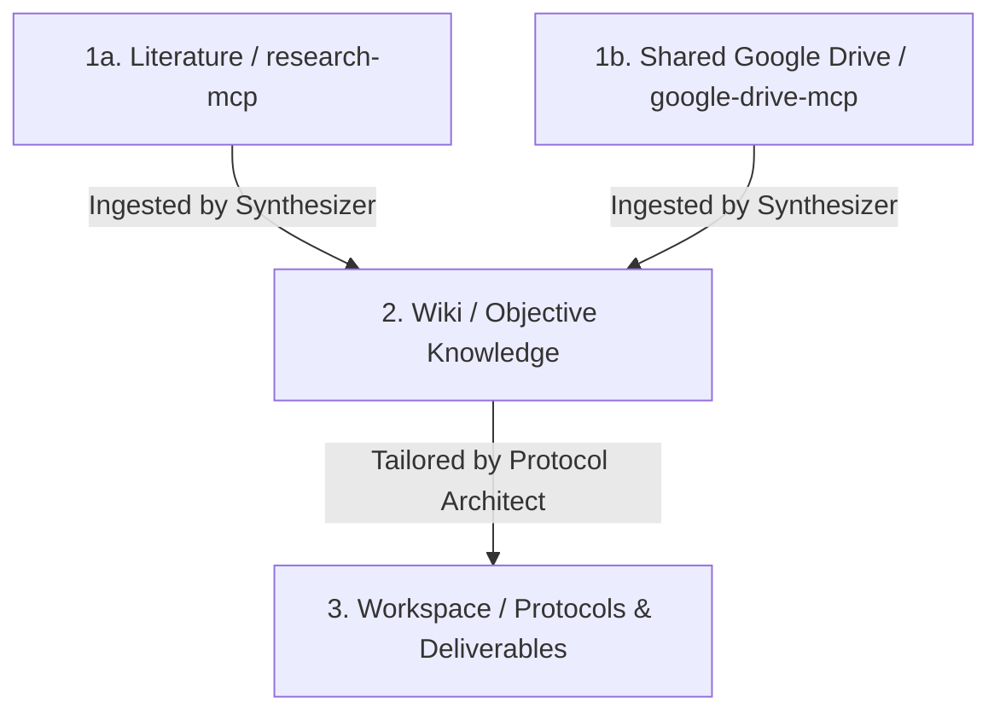

# 🦎 Podarcis - The Research and Wiki Builder Agent

| | |
| --- | --- |
| <br>⠀⠀⠀⠀⠀⠀⠀⠀⠠⣽⣆⡄⠀⠀⠀⠀⠀⠀⠀⠀⠀⠀⠀⠀⠀⠀<br>⠀⠀⠀⣤⣤⣤⣤⣄⡚⠻⣿⡀⠀⠀⠀⠀⠀⠀⠀⠀⠀⠀⠀⠀⠀⠀<br>⠀⠀⠀⣿⣿⣿⣿⣿⣿ ⣸⣿⠀⠀⠀⠀⠀⠀⠀⠀⠀⠀⠀⠀⠀⠀<br>⠀⢀⡀⠸⢿⣿⣿⣿⣿⣶⣿⠃⠀⠀⠀⠀⠀⠀⠀⠀⠀⠀⠀⠀⠀⠀<br>⠐⠲⣿⣼⠂ ⣿⣿⣿⣿⣿⣆⠀⢀⡀⠀⠀⠀⠀⠀⠀⠀⠀⠀⠀⠀<br> ⠈⠙⠻⣶⣼⣿⢿⣿⣿⣿⣿⡆⠙⢿⣦⣄⣀⠀⠀⠀⠀⠀⠀⠀⠀<br>⠀⠀⠀⠀⠀⠉⠁⢸⣿⣿⣿⣿⣿⠀⣀⣄⠉⠙⠛⠿⢷⣦⣀⠀⠀⠀<br>⠀⠀⠀⠀⢀⠰⣶⣶⣿⣿⣿⣿⣿⣿⣿⣿⡀⣠⠄⠀⠀⠈⠻⣿⡆⠀<br>⠀⠀⠠⠶⢮⣷⣿⡋⠋⠉⢹⣿⣿⠉⠀⠻⣷⣿⣿⡉⠓⠀⠀⢹⣿⠀<br>⠀⠀⠀⠋⠹⠉⠙⠁⠀⠀⠈⣿⣿⡇⠀⠀⠈⠉⠆⠁⠀⠀⠀⢸⣿⠇<br>⠀⠀⠀⠀⠀⠀⠀⠀⠀⠀⠀⠘⢿⣿⣄⠀⠀⠀⠀⠀⠀⠀⢀⣾⣿⠁<br>⠀⠀⠀⠀⠀⠀⠀⠀⠀⠀⠀⠀⠈⠻⣿⣦⣄⡀⡀⢀⣠⣴⣿⣿⠃⠀<br>⠀⠀⠀⠀⠀⠀⠀⠀⠀⠀⠀⠀⠀⠀⠈⠛⠿⠿⣿⣿⠿⠿⠋⠁⠀⠀<br> | **Podarcis**<br> *The Research and Wiki Builder Agent* <br><br>Installation:<br>```git clone https://github.com/XicuM/Podarcis.git```<br>```cd Podarcis```<br>```make install```<br> |

## 🚀 The Workflow Pipeline

Evidence progresses through a strict pipeline with a formal **Hierarchy of Evidence**:



1. **Research & Data Access:** Discovers peer-reviewed literature via `research-mcp` (Semantic Scholar) and accesses shared internal documents and raw data via `google-drive-mcp`. Literature reviews and code reviews are stored in `workspace/`.
2. **Ingest (Synthesis):** Compiles and resolves evidence from both `research-mcp` search results and Google Drive documents into the objective, anonymized `wiki/` knowledge base.
3. **Build Protocol & Deliverables (Actionable Output):** Adapts objective Wiki knowledge to specific goals, constraints, and parameters in `workspace/` (protocols, literature reviews, code reviews).

---

## 📁 Repository Structure

```text
├── .agents/              # Agent scripts, tools, and execution packages (skills)
│   ├── mcp/              # MCP servers (wiki, research, gdrive, finance, menumaker-mcp)
│   └── skills/           # Action packages (ingest, fact-check, harness, build-protocol, ...)
├── .podarcis/            # Core Podarcis engine: install, config, repo sync, and console UI
├── wiki/                 # Decoupled Repository: Synthesized, objective knowledge base (anonymized)
│                         #   → not present by default; cloned during `make install`
├── workspace/            # Decoupled Repository: Personal profile, feedback, active protocols, and reviews
│                         #   → not present by default; cloned during `make install`
├── opencode.json         # Generated MCP server definitions for OpenCode / compatible IDE agents

├── Makefile              # Developer workflow shortcuts
└── pyproject.toml        # Python package metadata and pytest configuration
```

> **Note:** `wiki/` and `workspace/` are independent git repositories that are not tracked by the main project's git index. They are cloned automatically during `make install` using the URLs defined in `.podarcis/config.yaml`.

---

## 🛠 Features & Capabilities

* **Literature Search**: `research-mcp` queries Semantic Scholar for peer-reviewed publications, abstracts, and citation graphs — the primary tool for evidence discovery.
* **Direct Google Drive Access**: `google-drive-mcp` provides access to internal team documents, raw data, and pre-prints not indexed in public databases, without staging files in the git repo.
* **Model Context Protocol (MCP)**: Native servers (`research-mcp`, `wiki-mcp`, `finance-mcp`, `google-drive-mcp`, `menumaker-mcp`) allow LLMs to search literature, query databases, read drive files, and interact with menus.
* **Hermetic Repositories**: The `wiki/` and `workspace/` directories are decoupled git repositories to ensure clear boundaries between objective knowledge and private context.
* **Modular Podarcis Engine**: The `.podarcis/` Python package provides interactive setup, configuration, and repository management tools, separating bootstrap from day-to-day configuration.

---

## ⚙️ Quick Start & Setup

### 1. Clone the Repository
```bash
git clone https://github.com/XicuM/Podarcis.git
cd Podarcis
```

### 2. Run Automated Setup
Run `make install` to automatically configure the Python virtual environment, install dependencies, create `.podarcis/config.yaml`, set up Google Drive credentials, install the `podarcis` CLI tool (and optionally link it to `~/.local/bin`), and clone workspace repositories:

```bash
make install
```

### 3. Configure & Use `podarcis` CLI
After setup, use the `podarcis` CLI tool for agentic and user configuration, testing, and status inspection:

```bash
# View status of MCP servers, skills, agents, and repos (human or JSON format for agents)
podarcis status
podarcis status --json

# Non-interactive configuration changes
podarcis config enable skill harness
podarcis config disable mcp finance-mcp

# Launch interactive TUI configuration menu
podarcis config interactive

# Run tests or linting
podarcis test
podarcis lint
```

### 4. Build & Workflow Commands

| Command | Description |
|---|---|
| `make install` | Bootstrap venv, dependencies, credentials, and `podarcis` CLI |
| `podarcis status` | Display component, agent, skill, and repository status (`--json` supported) |
| `podarcis config` | Non-interactive (`enable`/`disable`/`repo`) or interactive (`interactive`) config |
| `podarcis test` | Run test suite across all MCP servers and skills |
| `podarcis lint` | Run link integrity check across wiki markdown files |
| `make clean` | Clean Python build artifacts and cache files |

### 5. Connect MCP Servers to your Agent / IDE
The project automatically generates `opencode.json` defining native MCP servers from `.agents/mcp/` and `.agents/mcp_config.json`. The servers auto-detect the project root (via `AGENTS.md`) and use relative Python paths via `.venv/bin/python`.


If using Claude Desktop or another MCP client, reference `.venv/bin/python` and `.agents/mcp/*/server.py`.

---

## 📱 Mobile Integration (OpenClaw)

This workspace can be integrated with mobile-friendly agent frontends like **OpenClaw** (e.g., via Telegram).

To install this workspace as an autonomous skill, send this prompt to your OpenClaw-backed agent:
> "Clone this repository: `https://github.com/XicuM/Podarcis.git`. Keep the work for this project scoped to this workspace only. Install the skills in your main workspace. After install, inspect the project structure and help me finish setup. Ask before making any broader changes."
