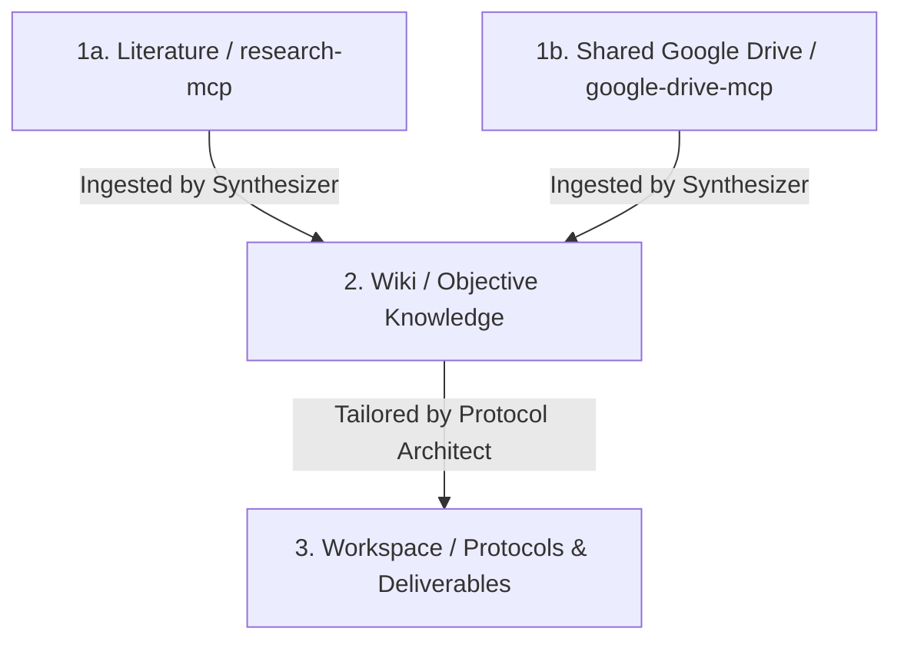

# Podarcis - The Research Agent with Memory

A modular, evidence-based system that automates the transformation of raw information (such as scientific literature, data, and documents) into a structured knowledge base (Wiki) and translates it into personalized, actionable guidelines (Protocols).

The architecture is entirely **filesystem-driven** and framework-agnostic. Multiple agents (or a single agent playing multiple roles) coordinate asynchronously by writing state changes to the filesystem and decoupled git repositories.

---

## 🚀 The Workflow Pipeline

Evidence progresses through a strict pipeline with a formal **Hierarchy of Evidence**:



1. **Research & Data Access:** Discovers peer-reviewed literature via `research-mcp` (Semantic Scholar) and accesses shared internal documents and raw data via `google-drive-mcp`. Literature reviews and code reviews are stored in `workspace/`.
2. **Ingest (Synthesis):** Compiles and resolves evidence from both `research-mcp` search results and Google Drive documents into the objective, anonymized `wiki/` knowledge base.
3. **Build Protocol & Deliverables (Actionable Output):** Adapts objective Wiki knowledge to specific goals, constraints, and parameters in `workspace/` (protocols, literature reviews, code reviews).

---

## 📁 Repository Structure

```text
├── .agents/              # Agent scripts, tools, and execution packages (skills)
│   ├── mcp/              # MCP servers (wiki, research, gdrive, finance, menumaker)
│   └── skills/           # Action packages (ingest, fact-check, harness, build-protocol, ...)
├── tui/                  # Python TUI package: setup, config, repo sync, and banner utilities
├── wiki/                 # Decoupled Repository: Synthesized, objective knowledge base (anonymized)
│                         #   → not present by default; cloned during `make setup`
├── workspace/            # Decoupled Repository: Personal profile, feedback, active protocols, and reviews
│                         #   → not present by default; cloned during `make setup`
├── podarcis.example.yaml # Template for local secrets and configuration (copy → podarcis.yaml)
├── opencode.json         # MCP server definitions for OpenCode / compatible IDE agents
├── Makefile              # Developer workflow shortcuts
└── pyproject.toml        # Python package metadata and pytest configuration
```

> **Note:** `wiki/` and `workspace/` are independent git repositories that are not tracked by the main project's git index. They are cloned automatically during `make setup` using the URLs defined in `podarcis.yaml`.

---

## 🛠 Features & Capabilities

* **Literature Search**: `research-mcp` queries Semantic Scholar for peer-reviewed publications, abstracts, and citation graphs — the primary tool for evidence discovery.
* **Direct Google Drive Access**: `google-drive-mcp` provides access to internal team documents, raw data, and pre-prints not indexed in public databases, without staging files in the git repo.
* **Model Context Protocol (MCP)**: Native servers (`research-mcp`, `wiki-mcp`, `finance-mcp`, `google-drive-mcp`, `menumaker`) allow LLMs to search literature, query databases, read drive files, and interact with menus.
* **Hermetic Repositories**: The `wiki/` and `workspace/` directories are decoupled git repositories to ensure clear boundaries between objective knowledge and private context.
* **Modular TUI**: The `tui/` Python package provides interactive setup, configuration, and repository management tools, separating bootstrap from day-to-day configuration.

---

## ⚙️ Quick Start & Setup

### 1. Clone the Repository
```bash
git clone https://github.com/XicuM/Podarcis.git
cd Podarcis
```

### 2. Run Automated Setup
Run the bootstrap script (or `make install`) to automatically configure the Python virtual environment, install dependencies, create `podarcis.yaml`, set up Google Drive credentials, and clone the decoupled workspace repositories:

```bash
make install
```

The script will prompt you to:
- Enable/disable the **QMD Vector DB** semantic search engine.
- Select the **Git clone protocol** (`ssh` / `https`) for workspace repositories.
- Authenticate **Google Drive** access (OAuth flow).

### 3. Configure MCP Servers & Skills (Optional)
After setup, use the interactive configuration tool to enable/disable individual MCP servers, skills, and repositories:

```bash
make config
```

### 4. Quick Commands (Makefile)

| Command       | Description                                           |
|---------------|-------------------------------------------------------|
| `make install`| Bootstrap venv, dependencies, config, and clone repos |
| `make config` | Interactively enable/disable MCP servers and skills   |
| `make sync`   | Sync (pull/clone) decoupled workspace repositories    |
| `make test`   | Run test suite across all MCP servers and skills      |
| `make lint`   | Run link integrity check across wiki markdown files   |
| `make clean`  | Clean Python build artifacts and cache files          |

### 5. Connect MCP Servers to your Agent / IDE
The project defines native MCP servers in `opencode.json`. The servers auto-detect the project root (via `AGENTS.md`) and use relative Python paths via `.venv/bin/python`.

If using Claude Desktop or another MCP client, reference `.venv/bin/python` and `.agents/mcp/*/server.py`.

---

## 📱 Mobile Integration (OpenClaw)

This workspace can be integrated with mobile-friendly agent frontends like **OpenClaw** (e.g., via Telegram).

To install this workspace as an autonomous skill, send this prompt to your OpenClaw-backed agent:
> "Clone this repository: `https://github.com/XicuM/Podarcis.git`. Keep the work for this project scoped to this workspace only. Install the skills in your main workspace. After install, inspect the project structure and help me finish setup. Ask before making any broader changes."
