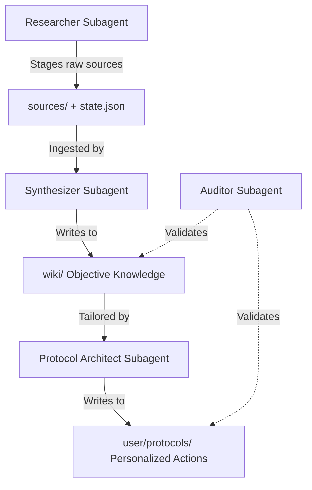

# Agentic Wiki Builder

A modular, evidence-based system that automates the transformation of raw information (such as scientific literature, data, and documents) into a structured knowledge base (Wiki) and translates it into personalized, actionable guidelines (Protocols).

The architecture is **filesystem-driven** and **agentic**: four specialized OpenCode subagents (defined in `.opencode/agents/`) coordinate asynchronously by writing state changes to the filesystem and decoupled git repositories. The primary agent (Build or Plan) automatically invokes the right subagent based on its description.

---

## The Workflow Pipeline

Evidence progresses through a strict pipeline with a formal **Hierarchy of Evidence**:



1. **Research**: The Researcher subagent discovers literature via `research-mcp`, downloads PDFs, extracts text with markitdown, and enqueues items in `sources/state.json`.
2. **Synthesis**: The Synthesizer subagent reads pending items from the queue, ingests raw sources, and compiles objective knowledge into the `wiki/`.
3. **Build Protocol**: The Protocol Architect subagent reads `user/profile.md`, adapts Wiki findings into step-by-step personalized protocols in `user/protocols/`.
4. **Audit**: The Auditor subagent runs continuous validation — lint checks, citation integrity, cross-reference audits, and fact-checking.

Subagents can be invoked automatically (based on their descriptions) or manually via `@mention` (e.g., `@researcher find papers on...`).

---

## Repository Structure

```text
├── .agents/                 # MCP servers, skills, and shared infrastructure
│   ├── mcp/                 # MCP servers (wiki, research, finance, menumaker, gdrive)
│   └── skills/              # Domain knowledge (menumaker, harness) — loaded via skill tool
├── .opencode/               # OpenCode configuration
│   └── agents/              # Subagent markdown definitions (researcher, synthesizer, protocol-architect, auditor)
├── sources/                 # Unified staging area for all raw inputs
├── tmp/                     # Temporary workspace for edits and scratchpads
├── wiki/                    # Decoupled Repository: Objective knowledge base (anonymized)
├── user/                    # Decoupled Repository: Personal profile, feedback, protocols
├── opencode.json            # MCP server registrations + agent config
├── AGENTS.md                # Agent architecture, conventions, and rules of engagement
└── sources/state.json       # Central ingestion queue manifest
```

---

## Features & Capabilities

* **Subagent Architecture**: Four specialized subagents (Researcher, Synthesizer, Protocol Architect, Auditor) auto-invoked by the primary agent based on task context. Each has tailored system prompts, permissions, and tool access defined in `.opencode/agents/`.
* **Asynchronous Handoffs**: Coordination mediated completely by `sources/state.json` and index updates. No active runtime orchestration required.
* **Model Context Protocol (MCP)**: Five native servers (`research-mcp`, `wiki-mcp`, `finance-mcp`, `menumaker`, `google-drive-mcp`) provide tool access for literature search, knowledge base queries, financial math, nutritional optimization, and Google Drive access.
* **Hermetic Repositories**: The `wiki/`, `user/`, and `sources/` directories are decoupled git repositories ensuring clear boundaries between objective knowledge and user-private context.

---

## Installation & Setup

### 1. Clone the Repository
```bash
git clone --recursive https://github.com/XicuM/agentic-wiki-builder.git
cd agentic-wiki-builder
```

### 2. Configure Environment & Dependencies
```bash
python -m venv .venv
source .venv/bin/activate
pip install -r requirements.txt
cp .example.env .env
```
Open `.env` and fill in your API credentials (e.g., `SEMANTIC_SCHOLAR_API_KEY`).

### 3. MCP Servers & Subagents
The project defines five MCP servers and four subagents in `opencode.json` and `.opencode/agents/`. These auto-detect the project root (via `AGENTS.md`) — no manual configuration needed when using OpenCode.

To verify the setup, open a session here and try invoking a subagent:
```
@auditor lint the wiki
```

### 4. Run the Test Suite
```bash
pytest
```

---

## Subagent Quick Reference

| Command | What it does |
|---|---|
| `@researcher <query>` | Searches literature, downloads papers, stages in `sources/` |
| `@synthesizer` | Ingests pending sources into `wiki/` (+ lint, update index) |
| `@protocol-architect <topic>` | Builds personalized protocol in `user/protocols/` from wiki + profile |
| `@auditor` | Lint checks, citation audits, cross-reference validation, fact-checking |

For full subagent workflows and conventions, see each `.opencode/agents/*.md` file and `AGENTS.md`.
